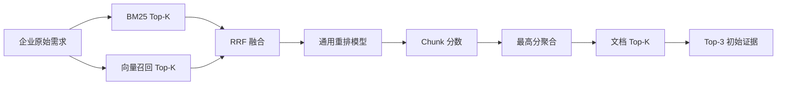
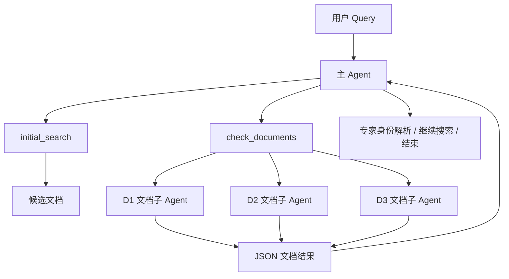
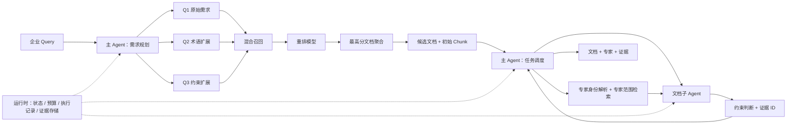

# 科研成果与专家检索 Agent

## 从领域检索失败诊断到文档级 Agent 执行


---

## 摘要

技术转移场景中的搜索并不是普通的论文关键词检索。企业通常使用自然语言描述业务目标，例如“寻找能在高温环境工作的可降解食品包装涂层”；论文和专利则使用材料体系、性能指标和实验条件描述技术。同一需求的多个约束还可能分散在摘要、方法、结果或权利要求等不同位置。系统不仅需要找到语义相关的论文与专利，还要沿作者或发明人关系发现潜在专家，并返回能够追溯到原文的支撑证据。

本文从一个不包含 Query 改写、模型微调和 Agent 的混合检索基线出发，依次研究 Query 表达敏感性、三路 Query 启动检索、检索失败分层、向量召回模型的领域微调，以及候选文档进入 Agent 后的证据检查与专家发现。检索层使用 BM25 稀疏召回与向量召回（Dense）并行搜索，通过倒数排名融合（RRF）合并结果，再由通用重排模型排序，并使用 `max(chunk_score)` 聚合文档。针对企业表达与科研语言之间的差距，系统在保留原始需求的同时，由主 Agent 一次生成术语扩展与约束扩展，并并行执行三路搜索。

结果显示，混合召回与通用重排模型将标注池 `Recall@5` 从 BM25 基线的 0.54 提升至 0.72；三路 Query 启动进一步提升至 0.85。失败归因表明，剩余问题主要集中在 Chunk 召回和初始证据不足，因此系统只微调向量召回模型，保留现成重排模型与简单的最高分文档聚合。微调数据构造中，高排名非锚点 Chunk 的不安全负例率达到 42.2%。采用校准后的重排模型将候选分为伪正例、忽略样本和困难负例后，相关 Chunk `Recall@100` 从 0.78 提升至 0.86，最终标注池 `Recall@5` 提升至 0.89。

当检索已经能够稳定找到候选后，任务瓶颈转为约束核验、证据补全和跨文档专家聚合。系统最终采用连续主 Agent 与并行文档子 Agent：主 Agent 负责需求解析、全局搜索、任务调度、专家关系和停止决策；每个文档子 Agent 只检查一篇文档，并返回结构化的约束支持情况与证据 Chunk ID；运行时负责预算、去重、执行记录和证据存储。相较“通用 Dense + 初始检索仅 Q1 + 单 Agent 动态检索”的端到端基线，最终系统将文档检索成功率从 0.63 提升至 0.88，将专家检索成功率从 0.48 提升至 0.81，并将 P95 延迟从 302 秒降至 132 秒。在相同的微调 Dense 与三路启动检索前端下，A1 到 A3 的对照进一步表明，其中文档子 Agent 架构贡献了 0.14 的文档成功率增量和 0.20 的专家成功率增量。

**关键词：** 信息检索，Query 扩展，向量召回，困难负例，Agent 检索，证据追踪，专家发现

---

## 1. 问题定义

### 1.1 业务输入与科研语料之间的表达鸿沟

企业需求往往从使用环境和业务目标出发：

> 我们需要一种能在高温环境工作的可降解包装涂层，最好适合食品接触。

科研文献可能使用如下表达：

```text
bio-based barrier coating
thermal stability
food-contact compliance
compostable polymer coating
oxygen and water-vapor barrier
```

两类文本描述的是同一个技术方向，但字面重合有限。传统关键词搜索容易遗漏术语不一致的相关成果；通用语义模型虽然可以跨越部分词汇差距，但仍面临科研领域偏移、专利语言特殊和多约束分散等问题。

### 1.2 系统任务

系统接受一条企业自然语言技术需求，返回三类结果：

1. **文档结果**：与需求相关的论文或专利；
2. **专家结果**：由相关成果及作者、发明人关系支持的潜在合作专家；
3. **证据**：支持文档或专家相关性的原文 Chunk 与定位信息。

专家不是通过姓名、机构简介或研究标签直接匹配，而是沿着“需求 → 相关成果 → 作者或发明人 → 专家”的路径发现。这使专家推荐能够追溯到具体技术成果，而不是依赖模糊的个人画像。

### 1.3 检索单位与返回单位

系统在 Chunk 层执行召回与重排，在文档层组织候选，在专家层聚合跨文档关系：


Chunk 重排分数表示“当前 Chunk 对原始需求提供局部技术证据的强度”，而不是“整篇文档满足全部约束的概率”。因此：

- 高分 Chunk 表明所属文档值得检查；
- 低分 Chunk 不能直接证明整篇文档不相关；
- 一篇文档是否满足多项约束，需要在文档内汇总多段证据；
- 重排模型不承担最终业务结论。

### 1.4 系统边界

系统负责回答：

- 找到了哪些可能相关的科研成果；
- 哪些原文支持相关性判断；
- 哪些作者或发明人与这些成果存在可验证关系。

系统不负责：

- 生成材料配方或技术制备方案；
- 判断成果是否具有商业化可行性；
- 判断专利新颖性、保护范围或侵权风险；
- 替代领域专家作出合作或投资决策。

---

## 2. 数据与评测协议

### 2.1 语料构成

配置包含论文与专利两类语料。所有原文保留用于追溯，但候选生成阶段排除容易造成“引用即相关”误判的章节。

| 来源 | 文档数 | 有效 Chunk 数 | 不参与候选召回的章节 |
|---|---:|---:|---|
| 论文 | 22,466 | 763,857 | 相关工作（Related Work）、参考文献（References） |
| 专利 | 17,435 | 1,168,188 | 背景技术（Background） |
| 合计 | 39,901 | 1,932,045 | 以上章节仍保留用于审计 |

论文的引言（Introduction）不整体排除，因为许多论文会在其中直接概括自身方法与贡献。

### 2.2 Query 与数据划分

评测集包含 150 条真实企业技术需求，覆盖计算机科学、生物、材料、包装、化工、制造与环境技术等方向。这些 Query 直接来自业务需求表达，不由论文或专利内容反向生成。

| 数据划分 | Query 数 | 用途 |
|---|---:|---|
| 开发集（Dev） | 50 条 | 选择检索方案、模型版本、提示词、阈值和工具预算 |
| 测试集（Test） | 100 条 | 系统配置确定后的最终性能评测 |

开发集可以在系统开发期间反复使用，用于比较不同技术方案并确定最终配置。测试集仅在模型、提示词、参数和执行流程全部确定后使用，不参与系统选择。

为避免数据泄漏，来源相同或技术内容高度相似的需求应放在同一划分中，不能同时出现在开发集和测试集。

### 2.3 Query—文档标签与标注池

文档使用三级相关性：

| 标签 | 定义 |
|---|---|
| 2 级 | 文档自身技术直接相关，能够支持核心需求 |
| 1 级 | 文档自身技术部分相关，只覆盖部分条件或相关性较弱 |
| 0 级 | 文档自身技术不相关 |

仅在相关工作、参考文献或专利背景技术中描述了相关技术，不会使当前文档获得 1 级或 2 级标签。

训练阶段的 Query–Chunk 标签与文档标签分开：

| 标签 | Query–Chunk 定义 | 训练处理 |
|---|---|---|
| C2 | 当前 Chunk 直接支持 Query | 伪正例 |
| C1 | 部分支持或证据不足 | 忽略 |
| C0 | 当前 Chunk 技术内容不相关 | 困难负例 |

### 2.4 核心指标

**标注池 Recall@5** 衡量人工确认的强相关文档有多少进入前五名：

```text
Gq = 标注池中所有 2 级文档

Recall@5(q)
= |Top-5(q) ∩ Gq| / |Gq|
```

**nDCG@10** 使用 0/1/2 三级相关性，衡量相关结果是否排在前面。

**相关 Chunk Recall@M** 在重排前测量相关 Chunk 是否进入候选池，是向量召回模型的直接验收指标。

Agent 阶段额外使用：

- 文档检索成功率：最终结果中是否至少召回一个正确文档；
- 专家检索成功率：最终结果中是否至少召回一个正确专家；
- P95 延迟、累计输入与输出 Token，以及工具轮数。


### 2.5 文档解析与层级 Chunk

论文和专利均优先按原始章节结构、自然段和技术单元切分；只有语义单元超过长度上限时，才继续按语义边界拆分。

系统采用检索片段与上下文段两级结构：较小的检索片段用于 BM25、向量召回和重排，较大的上下文段供文档子 Agent 阅读。二者通过 `parent_id` 关联：

```text
上下文段：800–1600 Token
    ├── 检索片段 1：200–400 Token
    ├── 检索片段 2：200–400 Token
    └── 检索片段 3：200–400 Token
```

用于检索的 `search_text` 只拼接原始文档标题、章节路径和当前检索片段原文，不生成额外主题；未经拼接的 `raw_text` 单独保存，用于最终证据展示：

```text
search_text = document_title + section_path + raw_text
```

| 项目 | 初始配置 |
|---|---|
| 检索片段目标长度 | 200–400 Token |
| 检索片段最大长度 | 512 Token |
| 检索片段最小长度 | 80–100 Token |
| 上下文段长度 | 800–1600 Token |
| 重叠长度 | 0–50 Token |
| 切分优先级 | 章节 → 自然段 / 语义单元 → Token 上限 |
| 必备元数据 | 标题、章节路径、片段位置、`parent_id` |
| 辅助定位 | 前一 / 后一检索片段 ID |

---

## 3. 最小检索基线

### 3.1 基线架构

第一版系统不改写 Query、不训练模型，也不使用 Agent：



稀疏召回基线明确采用 BM25。BM25 与向量召回均以检索片段为检索单位，其中 BM25 检索字段为上一节定义的 `search_text`。两路分别取得候选 Chunk，RRF 按排名融合结果。通用重排模型统一使用企业原始需求和固定任务指令对候选 Chunk 排序。检索与重排的固定配置如下：

| 模块 | 参数 | 配置 |
|---|---|---|
| 候选召回 | 单路候选数 | BM25 Top-100；向量召回 Top-100 |
| 候选融合 | RRF 常数 / 截断 | `k = 60`；融合后保留 Top-160 |
| 跨 Query 合并 | 去重后候选上限 | 320 个检索片段，超过时按融合分数截断 |
| BM25 | `k1` / `b` / 检索字段 | 1.2 / 0.75 / `search_text` |
| 向量召回模型 | 基础模型 / 向量维度 | `Qwen/Qwen3-Embedding-0.6B` / 1024 |
| 向量表示 | 池化 / 归一化 / 相似度 | 最后一个 Token / L2 / 余弦相似度 |
| 向量输入 | Query / 文档最大长度 | 256 / 640 Token |
| 向量指令 | 使用方式 | 固定英文技术检索指令，仅加在 Query 端 |
| 向量索引 | HNSW 参数 | `M = 32`，`efConstruction = 200`，`efSearch = 128` |
| 重排模型 | 模型 / 微调方式 | `Qwen/Qwen3-Reranker-0.6B` / 不微调 |
| 重排推理 | 精度 / 最大输入 / 批量 | BF16 / 1024 Token / 64 对 |
| 重排输入 | 指令 / Query / 打分 | 固定英文技术匹配指令 / 企业原始需求 / yes-no Token logits 概率 |
| 文档聚合 | 聚合与返回 | `max(chunk_score)`；Top-5 文档；每篇保留 Top-3 证据 |

文档侧 640 Token 上限包含标题、章节路径和不超过 512 Token 的检索片段原文。单路 Query 经 RRF 后最多进入 160 个重排候选；多路 Query 合并去重后最多进入 320 个候选。最终文档分数为：

```text
document_score(d) = max(score(c)), c ∈ chunks(d)
```

最高分聚合并不声称整篇文档已经满足全部需求。它只表达：只要一篇文档中存在一段强相关局部证据，该文档就值得进入后续检查。每篇候选同时保留得分最高的 3 个 Chunk 作为初始证据。

### 3.2 组件消融

| 版本 | 检索路径 | 标注池 Recall@5 | nDCG@10 | P95 延迟 |
|---|---|---:|---:|---:|
| R0 | BM25 | 0.54 | 0.49 | 0.34 s |
| R1 | 向量召回 | 0.61 | 0.55 | 0.46 s |
| R2 | BM25 + 向量召回 + RRF | 0.68 | 0.61 | 0.65 s |
| R3 | R2 + 通用重排模型 | **0.72** | **0.69** | 0.98 s |

BM25 能够稳定找到包含明确材料名、工艺名和标准号的结果；向量召回更能适应自然语言与科研表达之间的语义差距；两者合并后存在互补收益。重排模型对 Recall@5 的提升小于对 nDCG@10 的提升，说明它的主要贡献是把局部证据更强的 Chunk 排到前面。

这一结果确定了后续所有实验的共同底座：BM25 + 向量召回 + RRF + 通用重排模型。后续技术必须在这一基线上证明独立增益。

---

## 4. Query 表达与三路启动检索

### 4.1 同一需求的表达敏感性

为了区分“需求信息缺失”和“同一语义的表达差异”，实验保持四项约束不变，只改变语言形式：

```text
包装涂层 + 可降解 + 耐高温 + 食品接触
```

| 表达版本 | 示例 |
|---|---|
| 术语对齐 | 检索适用于食品接触、具备热稳定性的可生物降解阻隔涂层 |
| 企业自然 | 需要一种能在高温环境工作的可降解包装涂层，最好适合食品接触 |
| 口语隐式 | 想找食品包装表面的环保涂层，加热后性能还能保持，用完可以自然分解 |

结果如下：

| 表达版本 | R0 Recall@5 | R1 Recall@5 | R2 Recall@5 | R3 Recall@5 | R3 nDCG@10 |
|---|---:|---:|---:|---:|---:|
| 术语对齐 | 0.66 | 0.71 | 0.77 | **0.81** | 0.77 |
| 企业自然 | 0.54 | 0.61 | 0.68 | **0.72** | 0.69 |
| 口语隐式 | 0.45 | 0.55 | 0.60 | **0.64** | 0.61 |

即使需求语义和约束保持不变，R3 在术语对齐与口语隐式表达之间仍相差 17 个百分点。这说明现有检索模型对表达形式敏感，也说明 Query 扩展存在可恢复空间。

### 4.2 为什么不直接替换原始 Query

大模型改写可能：

- 删除企业原始需求中的弱表达约束；
- 将“最好”“可选”等软约束误写成强约束；
- 加入原始需求没有声明的材料、法规或性能指标；
- 用一个看似专业但过窄的术语限制召回范围。

因此系统不使用单个改写 Query 覆盖用户原文，而是保留原始需求作为兜底。主 Agent 在任务开始时只调用一次结构化生成，输出约束与两条互补扩展：

```json
{
  "normalized_requirement": "高温环境下仍保持性能的可降解食品包装涂层",
  "target_types": ["paper", "patent", "expert"],
  "core_constraints": [
    {"id": "C1", "requirement": "高温环境或热稳定性"},
    {"id": "C2", "requirement": "可降解包装涂层"},
    {"id": "C3", "requirement": "适合食品接触"}
  ],
  "expansion_queries": [
    {"id": "Q2", "role": "terminology", "text": "bio-based compostable barrier coating with thermal stability and food-contact compliance"},
    {"id": "Q3", "role": "constraint-focused", "text": "food packaging coating retaining barrier performance under heat and satisfying biodegradability requirements"}
  ]
}
```

Q1 始终是未经改写的原始需求：

```text
Q1 original
Q2 terminology
Q3 constraint-focused
```

Q1、Q2、Q3 并行执行，候选跨 Query 合并去重，最后统一使用原始需求进行重排。这样，大模型生成错误主要增加候选噪声，不会删除原始分支能够找到的结果。

### 4.3 一路、两路与三路的递增对照

| 版本 | Query 组合 | 标注池 Recall@5 | nDCG@10 | 搜索次数 | 重排候选数 | P95 延迟 |
|---|---|---:|---:|---:|---:|---:|
| P0 | Q1 | 0.72 | 0.69 | 1 | 160 | 0.98 s |
| P2 | Q1 + Q2 | 0.80 | 0.75 | 2 | 248 | 1.34 s |
| P3 | Q1 + Q2 + Q3 | **0.85** | **0.79** | 3 | 310 | 1.42 s |
| 人工扩展参考 | 原始需求 + 人工扩展 | 0.88 | 0.82 | 3 | 302 | 参考结果 |

两条扩展由同一次大模型调用生成。搜索次数从 1 增至 3，但因为三路并行执行，P95 延迟仅从 0.98 秒增加到 1.42 秒，而不是三倍。


Q2 主要弥补专业术语差距，Q3 主要强调容易在长需求中被稀释的性能或使用条件。三路方案与人工扩展参考仍有 3 个百分点差距，但取得了稳定的独占相关成果，因此被保留为默认启动策略。


---

## 5. 检索失败分层与技术选择

### 5.1 为什么必须先归因

“没有找到相关成果”可能发生在完全不同的层级。如果不做分层归因，很容易用模型微调掩盖语料缺失、解析错误或聚合规则问题。

系统对每个未进入可信结果的已知正确文档从 F0 到 F5 顺序检查，并将其归到最早失败层：

| 层级 | 失败类型 | 判断条件 |
|---|---|---|
| F0 | 语料 / metadata | 文档缺失，或作者、来源类型等 metadata 错误 |
| F1 | 解析 / 章节 | 技术内容未正确解析，或章节被错误排除 |
| F2 | Chunk 召回 | 相关 Chunk 未进入三路合并候选池 |
| F3 | Chunk 重排 | 已召回相关 Chunk，但被排到截断线之后 |
| F4 | 文档聚合 / 去重 | Chunk 排名足够，但文档未进入 Top-K |
| F5 | 初始证据不足 | 文档已进入 Top-K，但初始证据不足以完成判断 |

一旦命中最早失败层就停止归因，避免同一个案例被重复计算。

### 5.2 论文与专利的失败分布

| 来源 | F0 | F1 | F2 | F3 | F4 | F5 |
|---|---:|---:|---:|---:|---:|---:|
| 论文 | 5% | 8% | **42%** | 14% | 9% | 22% |
| 专利 | 7% | 12% | **38%** | 10% | 15% | 18% |

F2 在论文和专利中都是最大失败来源，说明通用模型经过三路 Query 后仍难以召回部分领域内容。专利的 F1 与 F4 更高，主要来自段落结构、实施例长列表。F5 则表明，候选已经找到后，初始证据仍经常只覆盖部分条件。

### 5.3 技术选择

归因结果直接限制了优化范围：

| 观察 | 决策 |
|---|---|
| F2 是主要瓶颈 | 微调向量召回模型 |
| F3 较低 | 保留现成 Qwen3-Reranker 与固定任务指令 |
| F4 可由章节规则控制 | 保留最高分聚合，不引入复杂文档评分模型 |
| F5 明显存在 | 交给候选进入后的文档检查，不继续堆叠在线排序组件 |

这一轮只改变向量召回模型。重排模型、文档聚合、候选预算和 Query 组合全部保持不变，使微调收益可以被独立识别。


---

## 6. 向量召回微调与误标负例控制

### 6.1 训练样本构造

训练 Query 从候选有效章节中的锚点 Chunk 生成：

```text
锚点 Chunk
→ 生成企业式 Query
→ 当前向量召回模型挖掘高排名非锚点 Chunk
→ 构造正例 / 忽略样本 / 困难负例
```

锚点只说明 Query 由哪个 Chunk 生成，不说明它是唯一正例。高排名非锚点可能包含：

1. 另一篇文档中的直接相关技术；
2. 只支持部分条件、不能安全标负的 Chunk；
3. 术语相似但技术目标不同的真正困难负例。

若把所有非锚点全部标负，对比学习会主动降低 Query 与真实相关 Chunk 的相似度，制造新的召回失败。

### 6.2 高排名候选人工审计

从 1000 条训练 Query 的高排名非锚点候选中分层抽样 500 个 Query–Chunk 对。

| 标签 | 数量 | 比例 | 训练含义 |
|---|---:|---:|---|
| C2 直接支持 | 81 | 16.2% | 若标负则构成严格假负例 |
| C1 部分支持或证据不足 | 130 | 26.0% | 不安全样本，默认忽略 |
| C0 不相关 | 289 | 57.8% | 可作为困难负例 |

因此：

```text
严格假负例率（C2）= 16.2%
不安全负例率（C1 + C2）= 42.2%
```

下文将 C1 或 C2 进入困难负例集合的比例统一称为“不安全负例率”；其中只有 C2 属于严格意义上的假负例。

专利候选的不安全负例率为 48.2%，高于论文的 38.7%。专利中的可选材料枚举和分散实施例更容易产生局部相关但证据不足的 Chunk。

### 6.3 四种负例处理策略

以下四种策略在开发集上使用相同训练规模和评测协议，仅改变高排名非锚点候选的分流方式：

| 版本 | 非锚点处理方式 | 不安全负例率 | 标注池 Recall@5 | nDCG@10 | 相对处理成本 |
|---|---|---:|---:|---:|---:|
| N0 全部标负 | 全部作为困难负例 | 42.2% | 0.84 | 0.78 | 1.00× |
| N1 重排模型分流 | 高分正例、中间忽略、低分负例 | 11.8% | **0.89** | **0.82** | 1.08× |
| N2 大模型分流 | 按固定规则执行 C0/C1/C2 分流 | 5.6% | 0.95 | 0.91 | 2.73× |
| N3 人工分流 | 人工分流 | 2.0% | 0.98 | 0.95 | 6.80× |

开发集的人工审计数据只用于选择两个阈值：高阈值优先保证伪正例准确率，低阈值优先保证困难负例准确率，中间区域直接忽略。

默认 N1 数据管线的固定配置如下：

| 项目 | 配置 |
|---|---|
| 每条 Query 的锚点正例 | 1 个 |
| 伪正例上限 | 2 个 |
| 困难负例数 | 5 个 |
| 其他负例 | 同批次 Query 的正例作为批内负例 |
| 分数校准 | 在开发集上进行温度缩放 |
| 伪正例阈值 | `T_pos = 0.90` |
| 困难负例阈值 | `T_neg = 0.10` |
| 忽略规则 | C1 样本及两个阈值之间的候选不参与损失计算 |

大模型分流相较重排模型分流，将标注池 Recall@5 提升 6 个百分点、nDCG@10 提升 9 个百分点，并将不安全负例率降低 6.2 个百分点，说明显式的 C0/C1/C2 语义判断能够更好地处理局部支持、否定表达和证据不足。人工分流在此基础上进一步提升 3 个百分点 Recall 和 4 个百分点 nDCG，但处理成本达到 6.80×。大模型分流的处理成本为 2.73×，约为重排模型分流的 2.53 倍。因此系统选择 N1 作为默认批量数据管线，N2 用于高价值样本和精度优先的数据构造，N3 作为人工参考上限。

### 6.4 向量召回微调结果

两个版本使用相同的 Q1/Q2/Q3、BM25 召回结果、RRF、重排模型、候选预算、最高分聚合和测试集人工相关性标注。唯一变量是向量召回模型权重。

| 项目 | 配置 |
|---|---|
| 基础模型 / 微调范围 | `Qwen/Qwen3-Embedding-0.6B` / 全参数微调 |
| 数值精度 / 分布式策略 | BF16 / 4 卡 DDP，启用梯度检查点 |
| 训练目标 | 多正例 InfoNCE，温度系数 0.05 |
| 单卡批量 | 2 条 Query |
| 梯度累积 / 有效全局批量 | 4 / 32 条 Query |
| 优化器 | AdamW，权重衰减 0.01 |
| 初始学习率 | `2e-5` |
| 学习率调度 | 余弦退火，预热比例 0.10 |
| 梯度裁剪 | 1.0 |
| 最大训练轮数 | 5 Epoch |
| 验证与早停 | 每个 Epoch 验证；patience = 2 |
| 最优检查点 | 开发集相关 Chunk Recall@100 最高 |
| 随机种子 | 42 |
| 训练硬件 | 4 × RTX 4090 |

| 模型 | 相关 Chunk Recall@100 | 标注池 Recall@5 | nDCG@10 | 搜索次数 | P95 延迟 |
|---|---:|---:|---:|---:|---:|
| 通用向量召回 | 0.78 | 0.85 | 0.79 | 3 | 1.42 s |
| 微调后向量召回 | **0.86** | **0.89** | **0.83** | 3 | 1.47 s |
| 绝对增益 | **+0.08** | **+0.04** | **+0.04** | 0 | +0.05 s |

按来源切片：

| 来源 | 通用模型 Recall@5 | 微调模型 Recall@5 | 绝对增益 |
|---|---:|---:|---:|
| 论文 | 0.86 | 0.90 | +0.04 |
| 专利 | 0.82 | 0.87 | +0.05 |

向量召回微调首先修复了直接目标，即相关 Chunk 没有进入候选池；这一增益随后传递到文档召回。

---

## 7. 检索模块的职责边界

### 7.1 候选命中不等于任务完成

微调后的检索模块达到以下结果：

| 指标 | 结果 |
|---|---:|
| 相关 Chunk Recall@100 | 0.86 |
| 标注池 Recall@5 | 0.89 |
| nDCG@10 | 0.83 |

检索指标说明正确文档已经能够较稳定地进入候选，但人工检查仍发现：当前最高分 Chunk 经常只包含判断任务所需信息的一部分。

例如，一个 Chunk 可能清楚说明材料是可降解涂层，另一个 Chunk 才报告高温后的阻隔性能，食品接触信息则可能位于实验标准或应用讨论中。重排模型对每个局部 Chunk 打分，无法替代跨 Chunk 的约束判断。

### 7.2 职责交接

```text
检索模块
→ 找到值得检查的候选文档
→ 返回初始 Chunk 与来源 Query

Agent
→ 判断文档主题是否与需求相关
→ 检查初始 Chunk 支持了哪些约束
→ 围绕缺失约束执行文档内搜索
→ 发现并校验专家
→ 选择结果并停止
```

检索模块的完成门槛不是“每个约束都已经由初始证据证明”，而是“值得检查的候选稳定进入有限集合，继续增加在线检索组件的收益已经低于 Agent 补充证据的收益”。

---

## 8. Agent 架构的三阶段演化

### 8.1 阶段一：单 Agent 连续处理

最初实现让一个 Agent 在同一会话中依次检查所有候选：

```text
D1 Chunk
+ D2 Chunk
+ D3 Chunk
+ Query / 动作 / 观察结果
+ 专家 metadata
→ 单一连续上下文
```

这种方式最容易实现，也能保持稳定的会话前缀。但随着候选增多，模型每轮都要从混合历史中恢复各文档的检查进度、约束支持情况和剩余动作。完整原文不断进入主上下文，旧文档的内容会干扰当前判断。


### 8.2 阶段二：结构化状态维护全局过程

第二阶段将过程抽成由运行时维护的结构化状态：

```text
状态
├─ 任务             原始需求、约束、返回类型
├─ 结果             文档 / 专家 / 证据 ID
├─ 最近动作         动作与简要结果
├─ 文档             metadata、Query–Chunk 关系、约束支持情况
├─ 专家             身份、来源文档、代表作
└─ 预算             工具使用量与剩余额度
```

提示词组装器将其确定性渲染为：

```text
固定前缀
+ Markdown 状态视图
+ 最新观察结果
→ 下一步动作
```

结构化状态解决了过程可审计、循环检测和状态组织问题，但每轮重组完整状态视图会改变提示词后半部分，降低缓存复用，并把所有文档的状态继续交给同一个 Agent 处理。

### 8.3 阶段三：连续主 Agent + 文档子 Agent

最终架构保留主 Agent 的连续上下文，把每篇文档的检查隔离给独立文档子 Agent：



主 Agent 在同一会话中承担两个连续阶段：

1. **需求规划阶段**：解析需求、提取约束、生成 Q2/Q3 并启动初次检索；
2. **任务调度阶段**：接收候选、分派文档子 Agent、追加全局搜索、处理专家关系并决定停止。

需求规划不是独立模型或独立子 Agent，而是主 Agent 在任务开始时承担的一次性角色。

每个文档子 Agent 的边界为：

```text
输入：一篇文档、任务约束、初始 Chunk、局部预算
输出：一个结构化文档结果
不能：修改其他文档、做全局排序、选择最终专家或结束任务
```

文档子 Agent 的局部上下文短而连续，多篇文档可以并行检查。主 Agent 不接收子 Agent 的完整对话，只接收文档 metadata、主题判断、约束支持情况和证据 Chunk ID。结构化状态继续由运行时维护，用于监控、预算、恢复和审计，但不再作为完整快照覆盖主 Agent 的提示词。


---

## 9. 工具与运行时设计

### 9.1 工具从信息缺口倒推

工具不是为了展示 Agent 能调用多少接口，而是对应模型在不同阶段缺少的信息。

| 调用者 | 工具 | 解决的信息缺口 |
|---|---|---|
| 主 Agent | `initial_search` | 初次取得三路候选与初始 Chunk |
| 主 Agent | `search_documents` | 全局追加搜索，或在 `expert_scope` 内检索代表作 |
| 主 Agent | `check_documents` | 并行分派文档子 Agent |
| 主 Agent | `resolve_expert` | 校验专家身份与来源成果关系 |
| 主 Agent | `finish` | 选择最终文档、专家与证据 |
| 文档子 Agent | `read_document_overview` | 判断文档整体主题，避免只凭局部 Chunk 误判 |
| 文档子 Agent | `search_within_document` | 围绕缺失约束在当前文档内重新检索 |
| 文档子 Agent | `inspect_chunks` | 读取关键检索片段所属上下文段并核对元数据 |

`search_within_document` 对文档子 Agent 开放 Query，因为初始三路 Query 面向全局召回，不一定是最适合当前文档或当前缺失约束的表达。文档子 Agent 可以根据已读证据生成更具体的文档内 Query，但搜索结果本身不提供约束支持标签。只有文档子 Agent 阅读 Chunk 后，才能判断支持、部分支持或不支持。

`read_document_overview` 支持读取摘要、结论、权利要求概述等核心章节，用于判断整篇文档的主题。它不等于阅读全文，也不替代文档内搜索。

`inspect_chunks` 不只返回孤立的检索片段，而是返回关键检索片段所属的上下文段，并在其中标记当前关键检索片段的位置与 Chunk ID。文档子 Agent 阅读完整上下文段后，仍返回实际支持结论的检索片段 ID，使阅读上下文保持完整，同时保证最终证据能够精确定位。文档子 Agent 请求的 `document_id` 与 Chunk 实际归属不一致时，运行时返回明确错误，防止模型把其他文档的证据挂到当前文档。

### 9.2 文档子 Agent 的检查结果

```json
{
  "document_id": "D1",
  "title": "Bio-based barrier coating for food packaging",
  "document_type": "paper",
  "matched_query_ids": ["Q1", "Q3"],
  "authors": [
    {"expert_id": "X1", "name": "Alice Zhang", "role": "author"}
  ],
  "topic_match": "on_topic",
  "coverage": {
    "C1": {"status": "supported", "chunk_ids": ["C-D1-001"]},
    "C2": {"status": "supported", "chunk_ids": ["C-D1-004"]},
    "C3": {"status": "partial", "chunk_ids": ["C-D1-009"]}
  },
  "worker_stop_reason": "local_budget_exhausted"
}
```

每个字段都有明确消费者：

| 字段 | 消费者 | 用途 |
|---|---|---|
| `document_id`、`title`、`document_type` | 运行时、主 Agent | 去重、展示和类型切片 |
| `matched_query_ids` | 主 Agent、执行记录 | 说明该文档由哪些 Query 召回 |
| `authors` | 主 Agent | 产生专家候选 |
| `topic_match` | 主 Agent | 排除整体偏题文档 |
| `coverage` | 主 Agent、最终输出组装器 | 判断结果是否充分并加载证据 |
| `worker_stop_reason` | 运行时 | 监控预算和失败恢复 |

Chunk 原文不会进入主 Agent 的上下文。最终输出时，程序根据 `chunk_ids` 从证据存储加载原文、页码、章节和定位信息。

### 9.3 运行时职责

运行时不判断语义和约束支持情况，只负责可靠执行：

- 校验文档、Chunk 与专家 ID；
- 合并重复文档结果；
- 限制文档子 Agent 的并发数和局部预算；
- 更新结构化状态、执行记录与预算；
- 保存 Query、工具参数、观察结果摘要与证据；
- 在失败后恢复尚未完成的文档子 Agent；
- 组装最终证据文本。

这一边界避免程序规则假装理解语义，也避免模型承担本可由确定性代码完成的 ID 校验、去重和预算控制。

---

## 10. 跨文档的专家聚合

文档可以局部隔离，专家天然跨文档。系统不建设独立专家子 Agent，而由主 Agent 统一管理关系。

### 10.1 来源成果校验

```text
D1、D2 的文档检查结果
→ 作者或发明人元数据
→ 候选专家 ID X1
→ resolve_expert(X1, [D1, D2])
→ 专家 metadata + 身份与来源关系校验
```

`resolve_expert` 必须显式接收 `expert_id` 和 `document_ids`。这同时解决两个问题：

1. 防止只凭姓名或机构简介产生专家；
2. 强制主 Agent 说明专家从哪些已经检查的成果中发现。

若来源文档尚未完成检查，工具返回 `requires_document_check`，不直接生成专家资料。

### 10.2 代表作检索

专家资料解析只返回身份与 metadata，不自动宣称哪些成果是“相关代表作”。主 Agent 使用专家范围检索：

```text
search_documents(
  query = "高温可降解食品包装涂层",
  document_types = ["paper", "patent"],
  expert_scope = "X1"
)
```

返回的 D4、D5 仍是普通候选文档，必须交给相同的文档子 Agent 检查。专家相关性最终由三部分共同支撑：

```text
来源文档的相关性结果
+ 专家身份与作者或发明人关系
+ 代表作文档的相关性结果
→ 专家结果
```


---

## 11. 完整运行案例

以下示例展示食品接触涂层需求如何从用户输入流转到成果与专家结果。

### 11.1 用户输入与需求规划

```text
用户：
我们需要一种能在高温环境工作的可降解包装涂层，最好适合食品接触。
```

主 Agent 解析：

```json
{
  "original_query": "我们需要一种能在高温环境工作的可降解包装涂层，最好适合食品接触。",
  "return_types": ["paper", "patent", "expert"],
  "document_search_types": ["paper", "patent"],
  "constraints": [
    {"id": "C1", "requirement": "高温环境下保持性能"},
    {"id": "C2", "requirement": "可降解包装涂层"},
    {"id": "C3", "requirement": "适合食品接触"}
  ],
  "query_bundle": {
    "Q1": "原始需求",
    "Q2": "bio-based compostable barrier coating with thermal stability and food-contact compliance",
    "Q3": "food packaging coating retaining barrier performance under heat and satisfying biodegradability requirements"
  }
}
```

主 Agent 调用：

```json
{
  "name": "initial_search",
  "arguments": {
    "query_ids": ["Q1", "Q2", "Q3"],
    "document_types": ["paper", "patent"]
  }
}
```

运行时执行三路检索、合并、去重、统一重排和最高分聚合，返回 D1、D2、D3 与初始 Chunk ID。

### 11.2 文档子 Agent 并行检查

主 Agent 调用：

```json
{
  "name": "check_documents",
  "arguments": {
    "document_ids": ["D1", "D2", "D3"]
  }
}
```

D1 文档子 Agent 首先读取摘要与结论，确认论文主题是 bio-based barrier coating。初始 Chunk 支持 C2，但没有充分说明 C1 与 C3。随后执行：

```json
{
  "name": "search_within_document",
  "arguments": {
    "document_id": "D1",
    "query": "thermal stability after heating and food-contact migration or compliance"
  }
}
```

搜索返回 C-D1-004 与 C-D1-009。文档子 Agent 使用 `inspect_chunks` 读取原文和 metadata，最终返回：

```json
{
  "document_id": "D1",
  "topic_match": "on_topic",
  "coverage": {
    "C1": {"status": "supported", "chunk_ids": ["C-D1-004"]},
    "C2": {"status": "supported", "chunk_ids": ["C-D1-001"]},
    "C3": {"status": "partial", "chunk_ids": ["C-D1-009"]}
  }
}
```

D2 文档子 Agent 发现专利实施例同时支持 C1、C2、C3。D3 文档子 Agent 通过摘要与权利要求概述判断其核心是耐高温包装设备，而不是涂层材料，因此返回 `topic_match = off_topic`。

### 11.3 专家发现与代表作检查

D1 的作者和 D2 的发明人 metadata 指向同一个规范化专家 ID X1。主 Agent 调用：

```json
{
  "name": "resolve_expert",
  "arguments": {
    "expert_id": "X1",
    "document_ids": ["D1", "D2"]
  }
}
```

工具确认 X1 的身份、机构和与 D1/D2 的作者或发明人关系。主 Agent 随后在专家范围内检索相关代表作：

```json
{
  "name": "search_documents",
  "arguments": {
    "query": "high-temperature biodegradable food packaging barrier coating",
    "document_types": ["paper", "patent"],
    "expert_scope": "X1"
  }
}
```

工具返回 D4、D5。主 Agent 再次调用 `check_documents`。D4 获得 C1/C2/C3 的完整支持；D5 只讨论常温阻隔性能，被保留为部分相关但不进入最终强相关结果。

### 11.4 停止与最终输出

主 Agent 判断已经获得：

- 3 篇强相关成果 D1、D2、D4；
- 1 名由来源成果和代表作共同支持的专家 X1；
- 每项核心约束对应的证据 Chunk ID；
- 没有未解决的关键身份冲突。

因此调用：

```json
{
  "name": "finish",
  "arguments": {
    "document_ids": ["D1", "D2", "D4"],
    "expert_ids": ["X1"],
    "reason": "已达到成果数量、核心约束覆盖和专家证据门槛"
  }
}
```

最终输出由程序从证据存储加载对应原文，形成：

```text
文档 D1
  相关性：高
  支持：C1、C2；C3 部分支持
  证据：C-D1-001、C-D1-004、C-D1-009

文档 D2
  相关性：高
  支持：C1、C2、C3
  证据：C-D2-002、C-D2-006、C-D2-011

专家 X1
  来源成果：D1、D2
  相关代表作：D4
  身份关系：已校验
```

---

## 12. 端到端基线与 Agent 组织方式实验

### 12.1 对照方案

实验同时设置端到端基线 E1 和三种 Agent 组织方案。E1 与 A1 使用相同的 Agent 模型、工具集合、动态检索策略和最大执行预算，BM25、RRF、重排模型、候选预算与文档聚合方式也保持不变；只改变初始检索前端中的向量召回模型和 Query 组合：E1 使用通用向量召回模型并仅执行 Q1，A1 使用微调后的向量召回模型并执行 Q1/Q2/Q3。A1、A2、A3 使用完全相同的检索前端，只改变上下文与 Agent 组织方式。

E1 的“仅 Q1”限定初始全局检索；文档内补充检索和专家范围代表作检索仍然开放，并与 A1 保持一致。因此，E1→A1 衡量检索前端整体升级的增量，A1→A3 衡量文档子 Agent 架构的增量。

四种方案的 Agent 统一使用 `Qwen/Qwen3-8B-AWQ`，推理服务部署在 4 × RTX 4090 上，每张 GPU 运行一个数据并行服务副本。每个副本通过连续批处理同时处理多个 Agent 会话，运行时根据请求队列和 GPU 负载动态分派文档检查任务。

| 方案 | 向量召回模型 | 初始 Query | Agent 组织方式 |
|---|---|---|---|
| E1 | 通用 Dense | 仅 Q1 | 单 Agent 连续动态检索 |
| A1 | 微调 Dense | Q1 + Q2 + Q3 | 单 Agent 连续动态检索 |
| A2 | 微调 Dense | Q1 + Q2 + Q3 | 单 Agent + 状态 → Markdown 提示词 |
| A3 | 微调 Dense | Q1 + Q2 + Q3 | 连续主 Agent + 并行文档子 Agent |

| 项目 | 配置 |
|---|---|
| Agent 模型 | `Qwen/Qwen3-8B-AWQ` |
| 推理硬件 | 4 × RTX 4090；每卡一个服务副本 |
| 并发方式 | 数据并行副本、连续批处理、分块 Prefill 与动态调度 |
| 思考模式 | 开启 |
| 采样参数 | `temperature = 0.6`，`top_p = 0.95`，`top_k = 20` |
| 单次调用最大输出 | `max_new_tokens = 4096` |

### 12.2 质量、延迟与执行开销

文档检索成功率和专家检索成功率衡量最终任务质量；累计输入 Token、累计输出 Token 和工具轮数用于解释不同方案的计算开销。每次模型发起工具调用并取得结果记为一轮。累计 Token 统计一次完整任务中所有主 Agent 和文档子 Agent 调用的总量，P95 延迟按用户请求到最终结果的墙钟时间计算。

| 方案 | 文档检索成功率 | 专家检索成功率 | 平均累计输入 Token | 平均累计输出 Token | 平均工具轮数 | P95 延迟 |
|---|---:|---:|---:|---:|---:|---:|
| E1 通用 Dense + Q1 + 单 Agent | 0.63 | 0.48 | 118k | 34k | 31.7 | 302 s |
| A1 单 Agent 连续执行 | 0.74 | 0.61 | 126k | 31k | 29.4 | 286 s |
| A2 状态提示词 | 0.81 | 0.70 | 168k | 23k | 23.1 | 241 s |
| A3 主 Agent + 文档子 Agent | **0.88** | **0.81** | **94k** | 38k | 36.8 | **132 s** |

E1 只有一路初始检索，累计输入 Token 略低；但通用 Dense 和仅 Q1 更容易遗漏合适候选，单 Agent 因此需要进行更多补充搜索与反复判断，使累计输出 Token、工具轮数和 P95 延迟均高于 A1。

A1 的微调 Dense 与三路启动检索增加了初始候选输入，但减少了后续无效搜索。连续上下文有利于复用会话前缀，但所有候选文档仍由同一个 Agent 依次处理。随着历史增长，模型需要持续恢复文档进度、比较约束覆盖情况并决定下一步动作，因此累计输出 Token 和串行工具轮数仍然较高。

A2 每轮重新生成完整 Markdown 状态，累计输入 Token 高于 A1；但显式状态减少了模型恢复进度、重复判断和无效工具调用所需的输出，使累计输出 Token 和工具轮数下降。因此，A2 的任务质量高于 A1，P95 延迟也由 286 秒下降至 241 秒。

A3 将单篇文档检查隔离给并行文档子 Agent。多个服务副本可以同时执行文档检查，因此尽管文档子 Agent 增加了模型调用数量、工具轮数和累计输出 Token，墙钟时间仍降至 132 秒。A3 的优势来自文档级并行和更短的局部上下文，而不是总生成量更少。

这组结果也说明，在多轮 Agent 系统中，累计输出 Token 比检索输入长度更能解释延迟。文档内容主要进入 Prefill 阶段，可以批量计算；模型思考、动作选择和结构化结果则需要逐 Token 生成，构成主要串行开销。

### 12.3 两阶段增量归因

| 对比 | 文档成功率增量 | 专家成功率增量 | P95 延迟变化 | 主要解释 |
|---|---:|---:|---:|---|
| E1 → A1 | +0.11 | +0.13 | 302 s → 286 s | 微调 Dense 与三路启动检索的整体增量 |
| A1 → A3 | +0.14 | +0.20 | 286 s → 132 s | 文档子 Agent、上下文隔离与并行执行的增量 |
| E1 → A3 | +0.25 | +0.33 | 302 s → 132 s | 从通用单 Agent 基线到最终系统的总增量 |

E1→A1 不是分别估计“模型微调”和“三路 Query”的独立贡献，而是衡量检索前端整体升级的效果；两项技术各自的增量已由第 4 章和第 6 章实验说明。A1→A3 保持检索前端不变，因此可以归因于文档级 Agent 组织方式。最终 A3 相较 E1 将文档检索成功率提升 25 个百分点、专家检索成功率提升 33 个百分点，同时将 P95 延迟降低 170 秒。

### 12.4 Agent 相对一次性结束的增益

12.2 和 12.3 比较的是多步 Agent 方案及其增量；本节进一步比较“微调 Dense 与三路检索后直接返回”和最终 A3，用于判断多步执行本身是否值得。直接返回方案从候选文档的作者或发明人元数据聚合专家候选，但不检查文档内缺失证据，也不检索专家代表作。

| 策略 | 文档检索成功率 | 专家检索成功率 | 平均累计输出 Token | 平均工具轮数 | P95 延迟 |
|---|---:|---:|---:|---:|---:|
| 微调 Dense + 三路检索 + 元数据聚合后直接结束 | 0.72 | 0.49 | 0.6k | 2.1 | 1.47 s |
| A3 主 Agent + 文档子 Agent | **0.88** | **0.81** | 38k | 36.8 | 132 s |

相较于检索与元数据聚合后直接结束，A3 将文档检索成功率提升 0.16、专家检索成功率提升 0.32，但 P95 延迟由 1.47 秒增加至 132 秒。额外开销主要来自主 Agent 与文档子 Agent 的多轮模型输出和工具交互，而不是候选文档进入模型时的 Prefill。

多步执行取得的收益主要来自三个可观察动作：

1. 对已经召回的正确文档补齐缺失约束证据；
2. 排除局部检索片段相似但文档整体主题偏离的结果；
3. 沿作者或发明人关系发现并检查专家的相关代表作。

因此，直接返回适用于低延迟、低证据要求的查询；A3 适用于需要约束核验、证据补全和专家发现的完整技术转移任务。主 Agent 始终先完成三路启动检索；当已有证据足以判断文档并得到专家结果时可以直接结束，只有缺少判断依据时才继续调用文档子 Agent。

---

## 13. 最终系统架构



### 13.1 职责边界

| 层级 | 职责 | 不负责 |
|---|---|---|
| 检索模块 | 跨越表达差距，找到值得检查的候选 | 证明文档满足全部约束 |
| 主 Agent | 需求解析、全局搜索、调度、专家聚合与停止 | 阅读所有 Chunk 全文 |
| 文档子 Agent | 单篇文档的主题与约束检查 | 跨文档排序和最终决策 |
| 运行时 | ID、预算、去重、状态、执行记录与证据存储 | 语义相关性判断 |


### 13.2 最终技术取舍

| 组件 | 决策 | 依据 |
|---|---|---|
| BM25 + 向量召回 + RRF | 保留 | 具有稳定互补召回收益 |
| 通用重排模型 | 保留 | 显著改善 nDCG，F3 不是主瓶颈 |
| 三路 Query | 保留 | Q2、Q3 均提供独占 2 级文档 |
| 微调后向量召回 | 保留 | 修复 F2，并传递到文档召回 |
| 校准重排模型的数据分流 | 默认离线管线 | 批量吞吐和阈值复现性较好；大模型用于高价值样本 |
| 主 Agent + 文档子 Agent | 保留 | 文档/专家检索成功率与 P95 延迟最优；执行开销由输入、输出 Token 和工具轮数解释 |

---

## 14. 局限与风险

### 14.1 标注池 Recall 不是全语料绝对 Recall

评测真值来自多个系统 Top-K 合并后的标注池。它比单系统标注公平，但仍可能遗漏所有系统都未发现的相关成果。因此报告始终使用“标注池 Recall”，不宣称获得全语料绝对召回率。

### 14.2 Query 规划仍可能引入错误约束

保留 Q1 可以避免扩展 Query 覆盖原始输入，但错误扩展仍会扩大候选池、增加成本，并可能影响统一重排的截断。生产环境需要记录约束保留率、虚构约束率和每条扩展的独占相关成果。

### 14.3 专利语料仍然更难

专利的实施例、可选材料列表、家族版本和发明人元数据会增加解析与聚合错误。本文只判断技术相关性，不处理法律有效性、保护范围或商业价值。

### 14.4 Agent 判断不是人工专家结论

文档子 Agent 的约束判断只是基于原文证据的任务匹配判断。模型可能误解实验条件、否定表达或限定范围。高风险输出需要保留原文、页码和章节，供人工复核。

### 14.5 文档子 Agent 并行并不必然更便宜

并行文档子 Agent 会增加模型调用数。其成本优势依赖候选数量、单文档长度、缓存机制和并发配置。如果文档很短或候选很少，单 Agent 可能更简单。系统应保留按任务复杂度回退的能力。

---

## 15. 结论

本项目的核心不是简单叠加检索、微调与多 Agent 组件，而是建立一条可以被实验解释的技术决策链。

首先，混合召回和通用重排模型构成最小基线。表达敏感性实验说明企业语言与科研语言之间存在可恢复差距，因此系统保留原始 Query，并增加术语与约束两条并行扩展。其次，失败归因将主要瓶颈定位在 Chunk 召回，而不是重排或文档聚合，因此只微调向量召回模型。训练阶段通过 Query–Chunk 审计发现高排名非锚点中存在大量不安全负例，最终使用校准后的重排模型完成伪正例、忽略样本和困难负例分流。

当检索已经稳定找到候选后，问题转为跨 Chunk 约束核验、证据补全和跨文档专家聚合。最终架构让连续主 Agent 负责全局决策，让并行文档子 Agent 隔离原文检查，让运行时负责确定性的状态、预算和证据管理。E1→A1 与 A1→A3 的两阶段对照分别确认了检索前端和文档级 Agent 组织方式的增量；最终系统相较 E1 将文档检索成功率提高 25 个百分点、专家检索成功率提高 33 个百分点。系统输出的不只是一个相关性分数，而是文档、专家与可追溯证据组成的证据链。

这一设计保留了足够的技术深度，同时让每个保留组件都对应明确的失败来源和可测量收益，从而使最终方案更接近可验证、可维护的生产系统。

---
