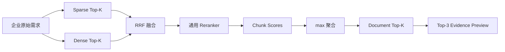
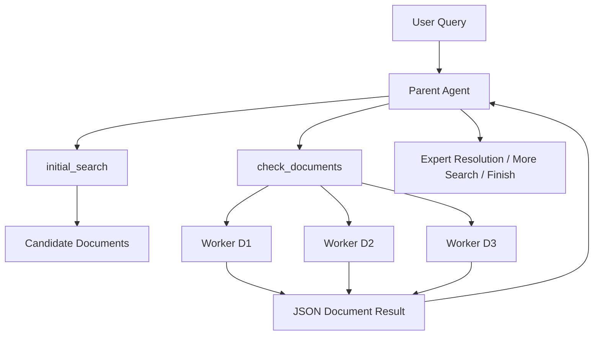
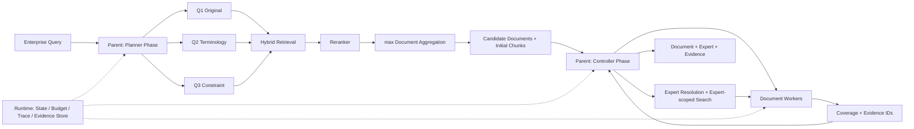

# 科研成果与专家检索 Agent

## 从领域检索失败诊断到文档级 Agent 执行

> 文档版本：V1，技术报告  
> 对应材料：`ppt-outline-v4.md` 保持不变，本报告不覆盖 PPT 提纲。

---

## 摘要

技术转移场景中的搜索并不是普通的论文关键词检索。企业通常使用自然语言描述业务目标，例如“寻找能在高温环境工作的可降解食品包装涂层”；论文和专利则使用材料体系、性能指标和实验条件描述技术。同一需求的多个约束还可能分散在摘要、方法、结果或权利要求等不同位置。系统不仅需要找到语义相关的论文与专利，还要沿作者或发明人关系发现潜在专家，并返回能够追溯到原文的支撑证据。

本文从一个不包含 Query 改写、模型微调和 Agent 的混合检索基线出发，依次研究 Query 表达敏感性、三路 Query 启动检索、检索失败分层、Dense Retriever 领域微调，以及候选文档进入 Agent 后的证据检查与专家发现。检索层使用 Sparse 与 Dense 并行召回、RRF 融合、通用 Reranker 重排和 `max(chunk_score)` 文档聚合。针对企业表达与科研语言之间的差距，系统在保留原始需求的同时，由 Parent Agent 一次生成术语扩展与约束扩展，并并行执行三路搜索。

结果显示，混合召回与通用 Reranker 将 `Pooled Recall@5` 从 Sparse 基线的 0.54 提升至 0.72；三路 Query 启动进一步提升至 0.85。失败归因表明，剩余问题主要集中在 Chunk 召回和初始证据覆盖，因此系统只微调 Dense Retriever，保留现成 Reranker 与简单的 max 文档聚合。微调数据构造中，高排名非 Anchor Chunk 的 Unsafe Negative Rate 达到 43.0%。采用校准 Reranker 将候选分为 pseudo-positive、mask 和 hard negative 后，微调 Dense 将 `Relevant Chunk Recall@100` 从 0.78 提升至 0.86，并将最终 `Pooled Recall@5` 提升至 0.89。

当检索已经能够稳定找到候选后，任务瓶颈转为约束核验、证据补全和跨文档专家聚合。系统最终采用连续 Parent Agent 与并行 Document Worker：Parent 负责需求解析、全局搜索、Worker 调度、专家关系和停止决策；每个 Worker 只检查一篇 Document，并返回结构化 Coverage 与 Evidence Chunk ID；Runtime 负责预算、去重、Trace 和 Evidence Store。与单 Agent 连续处理相比，该架构在实验中将完整任务成功率从 0.71 提升至 0.86，同时降低长上下文压力和重复动作率。

**关键词：** 信息检索，Query 扩展，Dense Retrieval，Hard Negative，Agentic RAG，证据追踪，专家发现

---

## 1. 问题定义

### 1.1 业务输入与科研语料之间的表达鸿沟

企业需求往往从使用环境和业务目标出发：

> 我们需要一种能在高温环境工作的可降解包装涂层，最好适合食品接触。

科研文献可能使用如下表达：

```text
bio-based barrier coating
thermal stability
food-contact compliance
compostable polymer coating
oxygen and water-vapor barrier
```

两类文本描述的是同一个技术方向，但字面重合有限。传统关键词搜索容易遗漏术语不一致的相关成果；通用语义模型虽然可以跨越部分词汇差距，但仍面临科研领域偏移、专利语言特殊和多约束分散等问题。

### 1.2 系统任务

系统接受一条企业自然语言技术需求，返回三类结果：

1. **Document Result**：与需求相关的论文或专利；
2. **Expert Result**：由相关成果及作者、发明人关系支持的潜在合作专家；
3. **Evidence**：支持 Document 或 Expert 相关性的原文 Chunk 与定位信息。

专家不是通过姓名、机构简介或研究标签直接匹配，而是沿着“需求 → 相关成果 → 作者或发明人 → 专家”的路径发现。这使专家推荐能够追溯到具体技术成果，而不是依赖模糊的个人画像。

### 1.3 检索单位与返回单位

系统在 Chunk 层执行召回与重排，在 Document 层组织候选，在 Expert 层聚合跨文档关系：


Chunk Reranker 的分数被定义为“当前 Chunk 对原始需求提供局部技术证据的强度”，而不是“整个 Document 满足全部约束的概率”。因此：

- 高分 Chunk 表明所属 Document 值得检查；
- 低分 Chunk 不能直接证明整个 Document 不相关；
- 一个 Document 是否满足多项约束，需要在 Document 内汇总多段证据；
- Reranker 不承担最终业务结论或 Document-level Verifier 的职责。

### 1.4 系统边界

系统负责回答：

- 找到了哪些可能相关的科研成果；
- 哪些原文支持相关性判断；
- 哪些作者或发明人与这些成果存在可验证关系。

系统不负责：

- 生成材料配方或技术制备方案；
- 判断成果是否具有商业化可行性；
- 判断专利新颖性、保护范围或侵权风险；
- 替代领域专家作出合作或投资决策。

---

## 2. 数据与评测协议

### 2.1 语料构成

配置包含论文与专利两类语料。所有原文保留用于追溯，但候选生成阶段排除容易造成“引用即相关”误判的章节。

| 来源 | Document 数 | 有效 Chunk 数 | 不参与正向候选的章节 |
|---|---:|---:|---|
| 论文 | 62,400 | 486,000 | Related Work、References |
| 专利 | 38,600 | 612,000 | Background |
| 合计 | 101,000 | 1,098,000 | 以上章节仍保留用于审计 |

论文的 Introduction 不整体排除，因为许多论文会在其中直接概括自身方法与贡献。专利在最终 Top-K 前按 `patent_family_id` 去重，避免同一发明的不同公开版本挤占候选位。

### 2.2 Query 与数据划分

评测集包含 120 条企业技术需求，覆盖材料、包装、化工、制造与环境技术方向。

| 数据划分 | Query 数 | 用途 |
|---|---:|---|
| Train | 420 条合成 Query + Anchor Chunk | Dense 领域微调 |
| Dev | 40 条人工需求 | 阈值、Prompt、预算与模型选择 |
| Test | 80 条人工需求 | 冻结系统后的最终评测 |

每条 Dev/Test Query 由人工提取核心约束，并构建 pooled candidate set：

```text
所有待比较系统的 Top-10
+ Anchor Positive
+ 1 个随机 Document
→ 去重
→ 双人独立标注
→ 冲突复核
```

共标注 1,846 个 Query–Document 对。双人标注的加权 Cohen's κ 为 0.81。

### 2.3 相关性标签

Document 使用三级相关性：

| 标签 | 定义 |
|---|---|
| Label 2 | Document 自身技术直接相关，能够支持核心需求 |
| Label 1 | Document 自身技术部分相关，只覆盖部分条件或相关性较弱 |
| Label 0 | Document 自身技术不相关 |

仅在 Related Work、References 或 Patent Background 中描述了相关技术，不会使当前 Document 获得 Label 1 或 Label 2。

训练阶段的 Query–Chunk 标签与 Document 标签分开：

| 标签 | Query–Chunk 定义 | 训练处理 |
|---|---|---|
| C2 | 当前 Chunk 直接支持 Query | pseudo-positive |
| C1 | 部分支持或证据不足 | mask |
| C0 | 当前 Chunk 技术内容不相关 | hard negative |

### 2.4 核心指标

**Pooled Recall@5** 衡量人工确认的强相关 Document 有多少进入前五名：

```text
Gq = judged pool 中所有 Label 2 Document

Pooled Recall@5(q)
= |Top-5(q) ∩ Gq| / |Gq|
```

**nDCG@10** 使用 0/1/2 三级相关性，衡量相关结果是否排在前面。

**Relevant Chunk Recall@M** 在 Reranker 前测量相关 Chunk 是否进入候选池，是 Dense Retriever 的直接验收指标。

Agent 阶段额外使用：

- Document Task Success：最终 Document 是否满足任务定义并带有证据；
- Evidence Core-constraint Coverage：核心约束中获得明确证据的比例；
- Expert Task Success：Expert 身份、来源成果与代表作支持是否完整；
- Action Duplication Rate：没有新增信息的重复工具调用占比；
- Token、缓存命中率、P95 延迟与单任务归一化成本。

所有系统比较使用相同 Query 的配对差值，并以 Query 为单位执行 bootstrap，报告 95% 置信区间。

---

## 3. 最小检索基线

### 3.1 基线架构

第一版系统不改写 Query、不训练模型，也不使用 Agent：



Sparse 与 Dense 各自召回 Chunk，RRF 对异构分数做基于排名的融合。通用 Reranker 统一使用企业原始需求与固定任务 instruction 对候选 Chunk 重排。最终文档分数为：

```text
document_score(d) = max(score(c)), c ∈ chunks(d)
```

max 聚合并不声称整篇文档已经满足全部需求。它只表达：只要一篇 Document 中存在一段强相关局部证据，该文档就值得进入后续检查。每篇候选同时保留得分最高的 3 个 Chunk 作为 Initial Evidence。

### 3.2 组件消融

| 版本 | 检索路径 | Pooled Recall@5 | nDCG@10 | P95 延迟 |
|---|---|---:|---:|---:|
| R0 | Sparse | 0.54 | 0.49 | 0.34 s |
| R1 | Dense | 0.61 | 0.55 | 0.46 s |
| R2 | Sparse + Dense + RRF | 0.68 | 0.61 | 0.65 s |
| R3 | R2 + 通用 Reranker | **0.72** | **0.69** | 0.98 s |

Sparse 能够稳定找到包含明确材料名、工艺名和标准号的结果；Dense 对自然语言与科研表达之间的语义差距更鲁棒；两者合并后存在互补收益。Reranker 对 Recall@5 的提升小于对 nDCG@10 的提升，说明它的主要贡献是把局部证据更强的 Chunk 排到前面。

这一结果确定了后续所有实验的共同底座：Sparse + Dense + RRF + 通用 Reranker。后续技术必须在这一基线上证明独立增益。

---

## 4. Query 表达与三路启动检索

### 4.1 同一需求的表达敏感性

为了区分“需求信息缺失”和“同一语义的表达差异”，实验保持四项约束不变，只改变语言形式：

```text
包装涂层 + 可降解 + 耐高温 + 食品接触
```

| 表达版本 | 示例 |
|---|---|
| 术语对齐 | 检索适用于食品接触、具备热稳定性的可生物降解阻隔涂层 |
| 企业自然 | 需要一种能在高温环境工作的可降解包装涂层，最好适合食品接触 |
| 口语隐式 | 想找食品包装表面的环保涂层，加热后性能还能保持，用完可以自然分解 |

结果如下：

| 表达版本 | R0 Recall@5 | R1 Recall@5 | R2 Recall@5 | R3 Recall@5 | R3 nDCG@10 |
|---|---:|---:|---:|---:|---:|
| 术语对齐 | 0.66 | 0.71 | 0.77 | **0.81** | 0.77 |
| 企业自然 | 0.54 | 0.61 | 0.68 | **0.72** | 0.69 |
| 口语隐式 | 0.45 | 0.55 | 0.60 | **0.64** | 0.61 |

即使需求语义和约束保持不变，R3 在术语对齐与口语隐式表达之间仍相差 17 个百分点。这说明现有检索模型对表达形式敏感，也说明 Query 扩展存在可恢复空间。但术语对齐表达是人工诊断上界，不是可直接部署的生产输入。

### 4.2 为什么不直接替换原始 Query

LLM 改写可能：

- 删除企业原始需求中的弱表达约束；
- 将“最好”“可选”等软约束误写成强约束；
- 加入原始需求没有声明的材料、法规或性能指标；
- 用一个看似专业但过窄的术语限制召回范围。

因此系统不使用单个改写 Query 覆盖用户原文，而是把原始需求保留为安全分支。Parent 在任务开始时只调用一次结构化生成，输出约束与两条互补扩展：

```json
{
  "normalized_requirement": "高温环境下仍保持性能的可降解食品包装涂层",
  "target_types": ["paper", "patent", "expert"],
  "core_constraints": [
    {"id": "C1", "requirement": "高温环境或热稳定性"},
    {"id": "C2", "requirement": "可降解包装涂层"},
    {"id": "C3", "requirement": "适合食品接触"}
  ],
  "expansion_queries": [
    {"id": "Q2", "role": "terminology", "text": "bio-based compostable barrier coating with thermal stability and food-contact compliance"},
    {"id": "Q3", "role": "constraint-focused", "text": "food packaging coating retaining barrier performance under heat and satisfying biodegradability requirements"}
  ]
}
```

Q1 始终是未经改写的原始需求：

```text
Q1 original
Q2 terminology
Q3 constraint-focused
```

Q1、Q2、Q3 并行执行，候选跨 Query 合并去重，最后统一使用原始需求进行 Reranker 重排。这样，LLM 生成错误主要增加候选噪声，不会删除原始分支能够找到的结果。

### 4.3 一路、两路与三路的递增对照

| 版本 | Query 组合 | Pooled Recall@5 | nDCG@10 | Search Calls | Reranker Candidates | P95 延迟 |
|---|---|---:|---:|---:|---:|---:|
| P0 | Q1 | 0.72 | 0.69 | 1 | 160 | 0.98 s |
| P2 | Q1 + Q2 | 0.80 | 0.75 | 2 | 248 | 1.34 s |
| P3 | Q1 + Q2 + Q3 | **0.85** | **0.79** | 3 | 310 | 1.42 s |
| Oracle | 原始需求 + 人工扩展 | 0.88 | 0.82 | 3 | 302 | 人工上界 |

两条扩展由同一次 LLM 调用生成。三路 Search Calls 从 1 增至 3，但因为并行执行，P95 延迟仅从 0.98 秒增加到 1.42 秒，而不是三倍。

补充诊断结果：

| 指标 | 结果 |
|---|---:|
| Q2 每条需求新增 Label 2 Document | 0.48 |
| Q3 每条需求新增 Label 2 Document | 0.31 |
| Q2/Q3 近重复率 | 8.3% |
| 三路 All-core-preserved rate | 98.8% |
| Hallucinated Constraint Rate | 1.8% |

Q2 主要弥补专业术语差距，Q3 主要强调容易在长需求中被稀释的性能或使用条件。三路方案与人工扩展上界仍有 3 个百分点差距，但取得了稳定的独占相关成果，因此被保留为默认启动策略。

公开研究中，Query2doc 也观察到 LLM 生成内容能够同时改善 Sparse 与 Dense Retrieval；本文不照搬其具体增益，而是采用“保留原始 Query，再测量扩展分支边际收益”的风险控制方式。[1]

---

## 5. 检索失败分层与技术选择

### 5.1 为什么必须先归因

“没有找到相关成果”可能发生在完全不同的层级。如果不做分层归因，很容易用模型微调掩盖语料缺失、解析错误或聚合规则问题。

系统对每个未进入可信结果的 Gold Document 从 F0 到 F5 顺序检查，并将其归到最早失败层：

| 层级 | 失败类型 | 判断条件 |
|---|---|---|
| F0 | Corpus / Metadata | 文档缺失，或作者、来源类型等元数据错误 |
| F1 | Parse / Section | 技术内容未正确解析，或章节被错误排除 |
| F2 | Chunk Recall | 相关 Chunk 未进入三路合并候选池 |
| F3 | Chunk Rerank | 已召回相关 Chunk，但被排到截断线之后 |
| F4 | Document Aggregation / Dedup | Chunk 排名足够，但 Document 未进入 Top-K |
| F5 | Initial Evidence Coverage | Document 已进入 Top-K，但 Initial Evidence 未覆盖核心约束 |

一旦命中最早失败层就停止归因，避免同一个案例被重复计算。

### 5.2 Paper 与 Patent 失败分布

| 来源 | F0 | F1 | F2 | F3 | F4 | F5 |
|---|---:|---:|---:|---:|---:|---:|
| Paper | 5% | 8% | **42%** | 14% | 9% | 22% |
| Patent | 7% | 12% | **38%** | 10% | 15% | 18% |

F2 在论文和专利中都是最大失败来源，说明三路 Query 之后仍存在领域召回不足。专利的 F1 与 F4 更高，主要来自段落结构、实施例长列表和专利家族重复。F5 则表明，候选已经找到后，Initial Evidence 仍经常只覆盖部分条件。

### 5.3 技术选择

归因结果直接限制了优化范围：

| 观察 | 决策 |
|---|---|
| F2 是主要瓶颈 | 微调 Dense Retriever |
| F3 较低 | 保留现成 Qwen3-Reranker 与固定 instruction |
| F4 可由章节规则和 family 去重控制 | 保留 max 聚合，不引入复杂 Document Scorer |
| F5 明显存在 | 交给候选进入后的文档检查，不继续堆叠在线排序组件 |

这一轮只改变 Dense Retriever。Reranker、Document 聚合、候选预算和 Query 组合全部冻结，使微调收益可以被独立识别。

通用 Dense Retriever 在领域迁移下出现性能下降并不意外。BEIR 显示不同领域和任务之间存在显著的 zero-shot 差异；GPL 等工作则表明目标领域伪标注能够改善 Dense Retrieval。[2][3]

---

## 6. Dense 微调与 False Negative 控制

### 6.1 训练样本构造

训练 Query 从候选有效章节中的 Anchor Chunk 生成：

```text
Anchor Chunk
→ 生成企业式 Query
→ 当前 Dense 挖掘 Top-ranked Non-anchor Chunks
→ 构造 Positive / Mask / Hard Negative
```

Anchor 只说明 Query 由哪个 Chunk 生成，不说明它是唯一正例。高排名非 Anchor 可能包含：

1. 另一篇文档中的直接相关技术；
2. 只支持部分条件、不能安全标负的 Chunk；
3. 术语相似但技术目标不同的真正 Hard Negative。

若把所有非 Anchor 全部标负，对比学习会主动降低 Query 与真实相关 Chunk 的相似度，制造新的召回失败。

### 6.2 高排名候选人工审计

从 420 条训练 Query 的高排名非 Anchor 候选中分层抽样 960 个 Query–Chunk 对。

| 标签 | 数量 | 比例 | 训练含义 |
|---|---:|---:|---|
| C2 直接支持 | 163 | 17.0% | False Negative，不能标负 |
| C1 部分支持或证据不足 | 250 | 26.0% | 不安全样本，默认 Mask |
| C0 不相关 | 547 | 57.0% | 可作为 Hard Negative |

因此：

```text
False Negative Rate = 17.0%
Unsafe Negative Rate = 43.0%
```

Patent 候选的 Unsafe Negative Rate 为 48.2%，高于 Paper 的 38.7%。专利中的可选材料枚举和分散实施例更容易产生局部相关但证据不足的 Chunk。

### 6.3 四种负例处理策略

| 版本 | 非 Anchor 处理方式 | 错误标负率 | Pooled Recall@5 | nDCG@10 | 相对处理成本 |
|---|---|---:|---:|---:|---:|
| N0 Naive | 全部作为 hard negative | 43.0% | 0.84 | 0.78 | 1.00× |
| N1 Calibrated Reranker | 高分正例、中间 Mask、低分负例 | 9.1% | **0.89** | **0.82** | 1.08× |
| N2 Prompted Teacher | 按固定 Rubric 执行 C0/C1/C2 分流 | 6.3% | 0.90 | 0.83 | 1.46× |
| N3 Human Triage | 人工分流 | 2.1% | 0.91 | 0.84 | 6.80× |

Reranker 的 sigmoid 分数不被解释为真实概率。Dev 人工审计集只用于选择两个阈值：高阈值追求 pseudo-positive precision，低阈值追求 hard-negative precision，中间区域直接 Mask。

Prompted Teacher 比校准 Reranker 多取得 1 个百分点 Recall，但处理成本增加 35% 以上，且没有显著缩小与人工上界的差距。因此最终选择 N1。Teacher 只保留为离线诊断工具，不进入默认数据管线，也不训练独立 Verifier。

### 6.4 Dense 微调结果

两个版本使用相同的 Q1/Q2/Q3、Sparse 结果、RRF、Reranker、候选预算、max 聚合和人工 Test qrels。唯一变量是 Dense 模型权重。

| 模型 | Relevant Chunk Recall@100 | Pooled Recall@5 | nDCG@10 | Search Calls | P95 延迟 |
|---|---:|---:|---:|---:|---:|
| Generic Dense | 0.78 | 0.85 | 0.79 | 3 | 1.42 s |
| Fine-tuned Dense | **0.86** | **0.89** | **0.83** | 3 | 1.47 s |
| 绝对增益 | **+0.08** | **+0.04** | **+0.04** | 0 | +0.05 s |

按来源切片：

| 来源 | Generic Recall@5 | Fine-tuned Recall@5 | 绝对增益 |
|---|---:|---:|---:|
| Paper | 0.86 | 0.90 | +0.04 |
| Patent | 0.82 | 0.87 | +0.05 |

Dense 微调首先修复了直接目标，即相关 Chunk 没有进入候选池；这一增益随后传递到 Document Recall。在线调用数不变，新增成本主要来自离线训练、模型版本和数据管线维护。

---

## 7. RAG 的完成边界

### 7.1 候选命中不等于任务完成

微调后的 RAG 达到以下结果：

| 指标 | 结果 |
|---|---:|
| Relevant Chunk Recall@100 | 0.86 |
| Candidate Document Recall@10 | 0.94 |
| Pooled Recall@5 | 0.89 |
| nDCG@10 | 0.83 |
| Initial Evidence Core-constraint Coverage | 0.66 |

候选文档召回已经达到 0.94，但 Initial Evidence 对核心约束的覆盖只有 0.66。两者的差距解释了为什么继续优化 Reranker 不能直接完成任务：正确文档往往已经出现，只是当前最高分 Chunk 没有包含所有判断所需的信息。

例如，一个 Chunk 可能清楚说明材料是可降解涂层，另一个 Chunk 才报告高温后的阻隔性能，食品接触信息则可能位于实验标准或应用讨论中。Reranker 对每个局部 Chunk 打分，无法替代跨 Chunk 的约束判断。

### 7.2 职责交接

```text
RAG
→ 找到值得检查的 Candidate Document
→ 返回 Initial Chunks 与来源 Query

Agent
→ 判断 Document 是否在主题内
→ 检查 Initial Chunk 支持了哪些约束
→ 围绕缺失约束执行文档内搜索
→ 发现并校验 Expert
→ 选择结果并停止
```

RAG 的停止门槛不是“每个约束都已经由 Initial Evidence 证明”，而是“值得检查的候选稳定进入有限集合，继续堆叠在线检索组件的边际收益低于执行层的补证据收益”。

---

## 8. Agent 架构的三阶段演化

### 8.1 阶段一：单 Agent 连续处理

最初实现让一个 Agent 在同一会话中依次检查所有候选：

```text
D1 Chunks
+ D2 Chunks
+ D3 Chunks
+ Query / Action / Observation
+ Expert Metadata
→ 单一连续上下文
```

这种方式最容易实现，也能保持稳定的会话前缀。但随着候选增多，模型每轮都要从混合历史中恢复各 Document 的检查进度、约束覆盖和剩余动作。完整原文不断进入主上下文，旧 Document 的内容会干扰当前判断。

长上下文并不等于模型能够稳定使用其中的所有信息。已有研究表明，相关信息的位置和上下文长度会显著影响模型表现，特别是信息位于长上下文中部时。[4]

### 8.2 阶段二：State 维护全局过程

第二阶段将过程抽成 Runtime 维护的 Canonical State：

```text
State
├─ Task             原始需求、约束、返回类型
├─ Result           Document / Expert / Evidence ID
├─ Recent Actions   最近动作与简要结果
├─ Documents        元数据、Query–Chunk 关系、Coverage
├─ Experts          身份、来源 Document、代表作
└─ Budget           工具使用量与剩余额度
```

Prompt Builder 将其确定性渲染为：

```text
Static Prefix
+ Markdown State View
+ Latest Observation
→ 下一步 Action
```

State 解决了过程可审计、循环检测和状态结构化问题，但每轮重组完整 State View 会改变 Prompt 后半部分，降低缓存复用，并把所有 Document 的状态继续交给同一个 Agent 处理。它是有价值的工程中间态，但不是最终主上下文方案。

### 8.3 阶段三：连续 Parent + Document Worker

最终架构保留 Parent 的连续上下文，把每篇 Document 的检查隔离给独立 Worker：



Parent 在同一会话中承担两个连续阶段：

1. **Planner Phase**：解析需求、提取约束、生成 Q2/Q3 并启动初次检索；
2. **Controller Phase**：接收候选、分派 Worker、追加全局搜索、处理 Expert 关系并决定停止。

Planner 不是独立模型或独立 Subagent，而是 Parent 在任务开始时承担的一次性角色。

每个 Document Worker 的边界为：

```text
输入：一个 Document、任务约束、Initial Chunks、局部预算
输出：一个结构化 Document Result
不能：修改其他 Document、做全局排序、选择最终 Expert 或结束任务
```

Worker 的局部上下文短而连续，多篇 Document 可以并行检查。Parent 不接收 Worker 的完整对话，只接收文档元数据、主题判断、约束 Coverage 和 Evidence Chunk ID。Canonical State 继续由 Runtime 维护，用于监控、预算、恢复和审计，但不再作为完整快照覆盖 Parent Prompt。

文档级并行与已有的 parallel context processing 研究方向一致：独立处理不同文档可以减少无关上下文干扰，但只有在质量、成本和延迟对照中取得收益时才值得保留。[5]

---

## 9. 工具与 Runtime 设计

### 9.1 工具从信息缺口倒推

工具不是为了展示 Agent 能调用多少接口，而是对应模型在不同阶段缺少的信息。

| 调用者 | 工具 | 解决的信息缺口 |
|---|---|---|
| Parent | `initial_search` | 初次取得三路候选与 Initial Chunks |
| Parent | `search_documents` | 全局追加搜索，或在 `expert_scope` 内检索代表作 |
| Parent | `check_documents` | 并行分派 Document Worker |
| Parent | `resolve_expert` | 校验 Expert 身份与来源成果关系 |
| Parent | `finish` | 选择最终 Document、Expert 与 Evidence |
| Worker | `read_document_overview` | 判断文档整体主题，避免只凭局部 Chunk 误判 |
| Worker | `search_within_document` | 围绕缺失约束在当前文档内重新检索 |
| Worker | `inspect_chunks` | 读取指定 Chunk 内容并核对元数据 |

`search_within_document` 对 Worker 开放 Query，因为初始三路 Query 面向全局召回，不一定是最适合当前文档或当前缺失约束的表达。Worker 可以根据已读 Evidence 生成更具体的文档内 Query，但搜索结果本身不提供 Coverage 标签。只有 Worker 阅读 Chunk 后，才能判断支持、部分支持或不支持。

`read_document_overview` 支持读取 Abstract、Conclusion、Claims Summary 等核心章节，用于判断整篇文档的主题。它不等于阅读全文，也不替代文档内搜索。

`inspect_chunks` 返回 Chunk 原文和 canonical metadata。Worker 请求的 `document_id` 与 Chunk 实际归属不一致时，Runtime 返回显式错误，防止模型把其他文档的证据挂到当前 Document。

### 9.2 Document Worker Result

```json
{
  "document_id": "D1",
  "title": "Bio-based barrier coating for food packaging",
  "document_type": "paper",
  "matched_query_ids": ["Q1", "Q3"],
  "authors": [
    {"expert_id": "X1", "name": "Alice Zhang", "role": "author"}
  ],
  "topic_match": "on_topic",
  "coverage": {
    "C1": {"status": "supported", "chunk_ids": ["C-D1-001"]},
    "C2": {"status": "supported", "chunk_ids": ["C-D1-004"]},
    "C3": {"status": "partial", "chunk_ids": ["C-D1-009"]}
  },
  "worker_stop_reason": "local_budget_exhausted"
}
```

每个字段都有明确消费者：

| 字段 | 消费者 | 用途 |
|---|---|---|
| `document_id`、`title`、`document_type` | Runtime、Parent | 去重、展示和类型切片 |
| `matched_query_ids` | Parent、Trace | 解释候选来源与 Query 边际贡献 |
| `authors` | Parent | 产生 Expert 候选 |
| `topic_match` | Parent | 排除整体偏题 Document |
| `coverage` | Parent、最终输出组装器 | 判断结果充分性并加载 Evidence |
| `worker_stop_reason` | Runtime | 监控预算和失败恢复 |

Chunk 原文不会进入 Parent 主上下文。最终输出时，程序根据 `chunk_ids` 从 Evidence Store 加载原文、页码、章节和定位信息。

### 9.3 Runtime 职责

Runtime 不做语义 Coverage 判断，只负责可靠执行：

- 校验 Document、Chunk 与 Expert ID；
- 合并重复 Document Result；
- 限制 Worker 并发数和局部预算；
- 更新 Canonical State、Trace 与 Budget；
- 保存 Query、Tool Arguments、Observation 摘要与 Evidence；
- 在失败后恢复尚未完成的 Worker；
- 组装最终证据文本。

这一边界避免程序规则假装理解语义，也避免模型承担本可由确定性代码完成的 ID 校验、去重和预算控制。

---

## 10. Expert 的跨 Document 聚合

Document 可以局部隔离，Expert 天然跨 Document。系统不建设独立 Expert Worker，而由 Parent 统一管理关系。

### 10.1 来源成果校验

```text
D1、D2 的 Document Worker Result
→ 作者或发明人元数据
→ 候选 Expert ID X1
→ resolve_expert(X1, [D1, D2])
→ Expert Metadata + 身份与来源关系校验
```

`resolve_expert` 必须显式接收 `expert_id` 和 `document_ids`。这同时解决两个问题：

1. 防止只凭姓名或机构简介产生专家；
2. 强制 Parent 说明 Expert 从哪些已经检查的成果中发现。

若来源 Document 尚未完成检查，工具返回 `requires_document_check`，不直接生成 Expert Profile。

### 10.2 代表作检索

专家资料解析只返回身份与元数据，不自动宣称哪些成果是“相关代表作”。Parent 使用专家范围检索：

```text
search_documents(
  query = "高温可降解食品包装涂层",
  document_types = ["paper", "patent"],
  expert_scope = "X1"
)
```

返回的 D4、D5 仍是普通 Candidate Document，必须交给相同的 Document Worker 检查。Expert 相关性最终由三部分共同支撑：

```text
来源 Document 的相关性结果
+ Expert 身份与作者或发明人关系
+ 代表作 Document 的相关性结果
→ Expert Result
```

Parent 可以直接根据结构化结果判断，不要求模型额外生成 Document–Support 表。后台为了审计可以投影关系视图，但它不是新的语义判断步骤。

---

## 11. 完整运行案例

以下示例展示食品接触涂层需求如何从用户输入流转到成果与专家结果。

### 11.1 用户输入与 Planner Phase

```text
用户：
我们需要一种能在高温环境工作的可降解包装涂层，最好适合食品接触。
```

Parent 解析：

```json
{
  "original_query": "我们需要一种能在高温环境工作的可降解包装涂层，最好适合食品接触。",
  "return_types": ["paper", "patent", "expert"],
  "document_search_types": ["paper", "patent"],
  "constraints": [
    {"id": "C1", "requirement": "高温环境下保持性能"},
    {"id": "C2", "requirement": "可降解包装涂层"},
    {"id": "C3", "requirement": "适合食品接触"}
  ],
  "query_bundle": {
    "Q1": "原始需求",
    "Q2": "bio-based compostable barrier coating with thermal stability and food-contact compliance",
    "Q3": "food packaging coating retaining barrier performance under heat and satisfying biodegradability requirements"
  }
}
```

Parent 调用：

```json
{
  "name": "initial_search",
  "arguments": {
    "query_ids": ["Q1", "Q2", "Q3"],
    "document_types": ["paper", "patent"]
  }
}
```

Runtime 执行三路检索、合并、去重、统一 Reranker 和 max 聚合，返回 D1、D2、D3 与 Initial Chunk ID。

### 11.2 Document Worker 并行检查

Parent 调用：

```json
{
  "name": "check_documents",
  "arguments": {
    "document_ids": ["D1", "D2", "D3"]
  }
}
```

Worker D1 首先读取摘要与结论，确认论文主题是 bio-based barrier coating。Initial Chunk 支持 C2，但没有充分说明 C1 与 C3。Worker 随后执行：

```json
{
  "name": "search_within_document",
  "arguments": {
    "document_id": "D1",
    "query": "thermal stability after heating and food-contact migration or compliance"
  }
}
```

搜索返回 C-D1-004 与 C-D1-009。Worker 使用 `inspect_chunks` 读取原文和元数据，最终返回：

```json
{
  "document_id": "D1",
  "topic_match": "on_topic",
  "coverage": {
    "C1": {"status": "supported", "chunk_ids": ["C-D1-004"]},
    "C2": {"status": "supported", "chunk_ids": ["C-D1-001"]},
    "C3": {"status": "partial", "chunk_ids": ["C-D1-009"]}
  }
}
```

Worker D2 发现专利实施例同时支持 C1、C2、C3。Worker D3 通过 Abstract 与 Claims Summary 判断其核心是耐高温包装设备，而不是涂层材料，因此返回 `topic_match = off_topic`。

### 11.3 Expert 发现与代表作检查

D1 的作者和 D2 的发明人元数据指向同一个规范化 Expert ID X1。Parent 调用：

```json
{
  "name": "resolve_expert",
  "arguments": {
    "expert_id": "X1",
    "document_ids": ["D1", "D2"]
  }
}
```

工具确认 X1 的身份、机构和与 D1/D2 的作者或发明人关系。Parent 随后在专家范围内检索相关代表作：

```json
{
  "name": "search_documents",
  "arguments": {
    "query": "high-temperature biodegradable food packaging barrier coating",
    "document_types": ["paper", "patent"],
    "expert_scope": "X1"
  }
}
```

工具返回 D4、D5。Parent 再次调用 `check_documents`。D4 获得 C1/C2/C3 的完整支持；D5 只讨论常温阻隔性能，被保留为部分相关但不进入最终强相关结果。

### 11.4 停止与最终输出

Parent 判断已经获得：

- 3 篇强相关成果 D1、D2、D4；
- 1 名由来源成果和代表作共同支持的 Expert X1；
- 每项核心约束对应的 Evidence Chunk ID；
- 没有未解决的关键身份冲突。

因此调用：

```json
{
  "name": "finish",
  "arguments": {
    "document_ids": ["D1", "D2", "D4"],
    "expert_ids": ["X1"],
    "reason": "已达到成果数量、核心约束覆盖和专家证据门槛"
  }
}
```

最终输出由程序从 Evidence Store 加载对应原文，形成：

```text
Document D1
  相关性：高
  支持：C1、C2；C3 部分支持
  Evidence：C-D1-001、C-D1-004、C-D1-009

Document D2
  相关性：高
  支持：C1、C2、C3
  Evidence：C-D2-002、C-D2-006、C-D2-011

Expert X1
  来源成果：D1、D2
  相关代表作：D4
  身份关系：已校验
```

---

## 12. Agent 组织方式实验

### 12.1 对照方案

三种方案使用相同 Query、候选 Document、模型、工具和总预算，只改变上下文与 Agent 的组织方式：

| 方案 | 组织方式 |
|---|---|
| A1 | 单 Agent + 原始连续上下文 |
| A2 | 单 Agent + State → Markdown Prompt |
| A3 | 连续 Parent + 并行 Document Worker |

### 12.2 质量、效率与稳定性

| 指标 | A1 连续单 Agent | A2 State Prompt | A3 Parent + Worker |
|---|---:|---:|---:|
| Document Task Success | 0.74 | 0.81 | **0.88** |
| Evidence Core-constraint Coverage | 0.70 | 0.80 | **0.87** |
| Expert Task Success | 0.61 | 0.70 | **0.81** |
| 完整任务成功率 | 0.71 | 0.78 | **0.86** |
| Action Duplication Rate | 9.4% | 3.8% | **1.9%** |
| 平均输入 Token | 58k | 74k | **46k** |
| Cache Hit Rate | 68% | 41% | **76%** |
| P95 延迟 | 31.6 s | 34.8 s | **23.9 s** |
| 归一化单任务成本 | 1.00× | 1.18× | **0.93×** |

A2 的结构化 State 显著降低重复动作并提高任务质量，但每轮重渲染动态 Prompt 增加输入 Token，并降低缓存命中率。A3 增加了 Worker 调用数，但每个 Worker 只保留单篇 Document 的短连续上下文，Parent 只接收 JSON 摘要；并行执行还降低了墙钟延迟。因此最终选择 A3，同时保留 Canonical State 作为 Runtime 控制平面。

### 12.3 Agent 相对一次性结束的增益

| 策略 | Document Task Success | Evidence Coverage | Expert Task Success | 平均 Tool Calls | P95 延迟 |
|---|---:|---:|---:|---:|---:|
| 三路检索后直接结束 | 0.72 | 0.66 | 0.49 | 3.0 | 1.47 s |
| 单 Parent 自适应执行 | 0.82 | 0.79 | 0.68 | 8.4 | 31.6 s |
| Parent + Worker | **0.88** | **0.87** | **0.81** | 10.7 | 23.9 s |

Agent 的收益不是来自重新解释 Reranker 分数，而是来自三个可观察动作：

1. 对已经召回的正确 Document 补齐缺失约束证据；
2. 排除局部 Chunk 相似但整篇主题偏离的 Document；
3. 沿作者或发明人关系发现并检查 Expert 的相关代表作。

额外工具调用明显增加，因此简单需求允许 Parent 在三路结果后直接结束。只有当 Evidence Coverage、Expert 返回或结果数量不足时，才进入多步执行。

---

## 13. 最终系统架构



### 13.1 职责边界

| 层级 | 职责 | 不负责 |
|---|---|---|
| RAG | 跨越表达差距，找到值得检查的候选 | 证明 Document 满足全部约束 |
| Parent | 需求解析、全局搜索、调度、Expert 聚合与停止 | 阅读所有 Chunk 全文 |
| Document Worker | 单篇 Document 的主题与 Coverage 检查 | 跨 Document 排序和最终决策 |
| Runtime | ID、预算、去重、状态、Trace 与 Evidence Store | 语义相关性判断 |

### 13.2 被删除的组件

**在线独立 Verifier** 被删除。现有系统中，Reranker 已提供 Query–Chunk 局部相关性排序，Document 的多约束核验由 Worker 完成。独立 Verifier 既不参与 RL 奖励，也没有证明能够在两者之间提供独立在线收益。

**独立 Expert Worker** 被删除。Expert 的关键是跨 Document 关系聚合，而不是另一套全文阅读流程。代表作继续复用 Document Worker。

**每轮覆盖 Parent 的完整 State Prompt** 被删除。Canonical State 保留给 Runtime 监控与恢复，Parent 使用连续会话，Worker 使用隔离的局部连续上下文。

**复杂 Document 聚合器** 被删除。排除外部工作章节并进行专利家族去重后，F4 不是主要瓶颈；max 聚合最符合“至少存在一处强证据就值得检查”的候选目标。

### 13.3 最终技术取舍

| 组件 | 决策 | 依据 |
|---|---|---|
| Sparse + Dense + RRF | 保留 | 具有稳定互补召回收益 |
| 通用 Reranker | 保留 | 显著改善 nDCG，F3 不是主瓶颈 |
| 三路 Query | 保留 | Q2、Q3 均提供独占 Label 2 Document |
| Fine-tuned Dense | 保留 | 修复 F2，并传递到 Document Recall |
| 校准 Reranker 数据分流 | 仅离线使用 | 接近 Teacher 收益且成本更低 |
| Parent + Document Worker | 保留 | 质量、延迟、Token 和稳定性综合最优 |
| Canonical State | 控制平面保留 | 用于预算、审计、恢复，不反复覆盖 Prompt |

---

## 14. 局限与风险

### 14.1 Pooled Recall 不是全语料绝对 Recall

评测真值来自多个系统 Top-K 合并后的 judged pool。它比单系统标注公平，但仍可能遗漏所有系统都未发现的相关成果。因此报告始终使用 `Pooled Recall`，不宣称获得全语料绝对召回率。

### 14.2 Query Planner 仍可能引入错误约束

保留 Q1 可以避免扩展 Query 覆盖原始输入，但错误扩展仍会扩大候选池、增加成本，并可能影响统一 Reranker 的截断。生产环境需要记录约束保留率、虚构约束率和每条扩展的独占相关成果。

### 14.3 专利语料仍然更难

专利的实施例、可选材料列表、家族版本和发明人元数据会增加解析与聚合错误。本文只判断技术相关性，不处理法律有效性、保护范围或商业价值。

### 14.4 Agent 判断不是人工专家结论

Worker Coverage 只是基于原文证据的任务匹配判断。模型可能误解实验条件、否定表达或限定范围。高风险输出需要保留原文、页码和章节，供人工复核。

### 14.5 Worker 并行并不必然更便宜

并行 Worker 会增加模型调用数。其成本优势依赖候选数量、单文档长度、缓存机制和并发配置。如果文档很短或候选很少，单 Agent 可能更简单。系统应保留按任务复杂度回退的能力。

---

## 15. 结论

本项目的核心不是把 RAG、Reranker、微调、Verifier 和多 Agent 同时放进一张架构图，而是建立一条可以被实验解释的技术决策链。

首先，混合召回和通用 Reranker 构成最小基线。表达敏感性实验说明企业语言与科研语言之间存在可恢复差距，因此系统保留原始 Query，并增加术语与约束两条并行扩展。其次，失败归因将主要瓶颈定位在 Chunk Recall，而不是 Reranker 或 Document 聚合，因此只微调 Dense Retriever。训练阶段通过 Query–Chunk 审计发现高排名非 Anchor 中存在大量不安全负例，最终使用校准 Reranker 完成 pseudo-positive、mask 和 hard negative 分流。

当检索已经稳定找到候选后，问题转为跨 Chunk 约束核验、证据补全和跨 Document 专家聚合。最终架构让连续 Parent 负责全局决策，让并行 Document Worker 隔离原文检查，让 Runtime 负责确定性的状态、预算和证据管理。系统输出的不只是一个相关性分数，而是 Document、Expert 与可追溯 Evidence 组成的证据链。

这一设计保留了足够的技术深度，但每个复杂组件都对应一个明确失败来源和可测量收益。没有独立收益的在线 Verifier、Expert Worker、完整 State Prompt 和复杂 Document 聚合器均被删除，从而使最终方案更接近可验证、可维护的生产系统。

---

